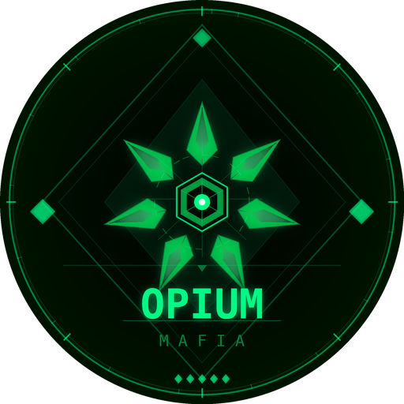

<p align="center">
  
</p>

<h1 align="center">Opium Mafia</h1>

<p align="center">
  Full-stack TypeScript platform for running live Mafia card games — a Telegram Mini App for players, an iPad app for the game master, and a real-time game server.
</p>

---

## Overview

Opium Mafia digitizes the experience of hosting live, in-person Mafia games. Players join games, reveal their secret roles, and follow the action through a Telegram Mini App on their phones. The game master (GM) runs the entire game from an iPad — assigning roles, resolving night actions, managing voting and timers — while the server keeps everyone in sync in real time and maintains persistent ratings, statistics, and leaderboards.

The system uses an **offline-first hybrid design**: the iPad GM app contains the full game engine and can run games without connectivity, syncing with the server before and after. The server acts as a relay and persistent store; the Telegram client is a thin real-time display layer.

## Apps

| App | Path | Description |
|-----|------|-------------|
| **Server** | `/server` | Fastify REST API + WebSocket server, PostgreSQL (Prisma), Redis, Telegram bot (grammY) |
| **Player Client** | `/client-app` | React Telegram Mini App for players (Vite, Zustand, Tailwind CSS) |
| **GM App** | `/gm-app` | React iPad app for the game master (Vite, Zustand) |
| **Shared** | `/shared` | Centralized TypeScript domain types used by all apps |

## Features

### Player App (Telegram Mini App)

- **Telegram-native authentication** — validated `initData` signature exchange, no passwords
- **Player registration** — name, unique nickname, date of birth, gender, Instagram, bio, and avatar (photo, emoji, or gradient initial)
- **Game lobby** — browse upcoming games, see location, cost, host contact, and remaining spots
- **Join / leave games** — including bringing guests, with optimistic UI updates
- **Live role reveal** — receive your secret role with team, icon, and signature phrase
- **Real-time game view** — phase changes, eliminations, votes, and results pushed over WebSocket
- **Profile and statistics** — rating history chart, games played, win rate, per-role stats, fouls
- **Leaderboard** — global player ranking by rating
- **Game history** — full record of past games with roles and rating breakdowns
- **Rules screen** — in-app game rules reference
- **Ban handling** — banned players are gated with a dedicated screen
- **Mobile-only Telegram gate** — the app only runs inside Telegram on Android/iOS

### GM App (iPad)

- **Device activation gate** — server-validated passphrase issues a signed activation token, re-verified on every load; iPad/Mac-only in production
- **Game creation and management** — name, date, time, location with map link, cost, and host contact (all required)
- **Seating circle** — visual round-table player layout with live status
- **Full game engine on device** — runs the entire game offline and syncs later
- **Role assignment** — automatic balanced distributions for 10–20 players
- **Night resolution** — nine-step fixed night order resolving kills, saves, checks, blocks, and frames
- **Day flow** — announcements, discussion timers, defense speeches, last words
- **Voting** — nomination and elimination voting with tie handling
- **Victory detection** — automatic win-condition checks after every phase
- **Rating calculator** — base points, role bonuses, survival bonuses, and foul penalties
- **Player management** — registered player roster, ban system, guest tracking
- **Game log** — complete timeline of every game event
- **Statistics dashboard** — aggregate game and player analytics

### Server

- **REST API** — users, games, roles, ratings, analytics, and auth endpoints (Fastify)
- **WebSocket relay** — broadcasts live game state (role reveals, phase changes, votes, eliminations) to connected players
- **PostgreSQL persistence** — users, clubs, games, players, ratings, bans, game states, and audit logs via Prisma
- **Redis** — fast state and session layer
- **Telegram bot notifications** — announces new games (with photo), updates, and cancellations to all registered users
- **Rating engine** — server-side authoritative rating calculation
- **Audit logging** — auth events, registrations, joins, deletions, and game actions
- **Metrics and health** — request logging, counters, and a `/health` endpoint

### Security

- **Telegram `initData` HMAC validation** with 24-hour expiry on every player auth
- **JWT-based sessions** for players; static API key + device activation for the GM app
- **CORS allowlist** — production origins only
- **GM device activation** — passphrase exchange returns a signed token bound to the device
- **Strict security headers** on the GM app (CSP, `X-Frame-Options: DENY`, `frame-ancestors: none`)
- **Server-side registration state** — the server, not client storage, is the source of truth

## Game Design

### Teams and Roles

Twelve roles across two teams:

| Team | Roles |
|------|-------|
| **Mafia** | 🎩 Don · 🔫 Mafia · 🎭 Framer · 💪 Enforcer |
| **Peaceful** | 🔍 Sheriff · 💊 Doctor · 💋 Hooker · 🔪 Maniac · 🛡️ Bodyguard · 👁️ Seer · 🐺 Werewolf · 🏠 Civilian |

Role distributions are predefined and balanced for every table size from **10 to 20 players**, with discussion and defense timers scaled to player count.

### Game Flow

```
lobby → night0 → (night ↔ day cycles) → end
```

- **Night 0** — roles wake for introductions; mafia meets
- **Night** — actions resolve in a fixed nine-step role order
- **Day** — announcements, discussion, nominations, defense speeches, voting, last words
- **End** — victory check, rating calculation, results pushed to all players

Complete rules and balance analysis live in [`docs/MAFIA_RULES.md`](docs/MAFIA_RULES.md) and [`docs/BALANCE_ODDS.md`](docs/BALANCE_ODDS.md).

## Architecture

```
┌──────────────────┐        WebSocket + REST        ┌──────────────────┐
│  Player Client   │ ◄────────────────────────────► │                  │
│  (Telegram Mini  │                                │      Server      │
│      App)        │                                │  Fastify + WS    │
└──────────────────┘                                │                  │
                                                    │  PostgreSQL      │
┌──────────────────┐        REST (API key +         │  Redis           │
│     GM App       │        activation token)       │  Telegram Bot    │
│     (iPad)       │ ◄────────────────────────────► │                  │
│  Full game       │                                └──────────────────┘
│  engine, offline │
└──────────────────┘
```

- **Shared types** (`/shared/types.ts`) define the entire game domain — roles, phases, night steps, timers, game state, WebSocket events — and are imported by all three apps via the `@shared` alias.
- **Game metadata** (name, schedule, location, cost, host) is stored in the game's JSON log; relational tables hold users, players, ratings, and bans.

## Tech Stack

| Layer | Technology |
|-------|-----------|
| Language | TypeScript everywhere |
| Server | Node.js, Fastify, `@fastify/websocket`, Prisma, PostgreSQL, Redis, grammY |
| Player client | React 18, Vite, Zustand, Tailwind CSS |
| GM app | React 18, Vite, Zustand |
| Auth | Telegram `initData` HMAC, JWT, device activation tokens |
| Testing | Playwright (UI, API, and mocked e2e suites) |
| Hosting | Cloudflare Pages (both frontends), Railway (server + PostgreSQL + Redis) |
| CI/CD | GitHub Actions |

## Getting Started

### Prerequisites

- Node.js 20+
- PostgreSQL 17 and Redis (or Docker)
- A Telegram bot token from [@BotFather](https://t.me/BotFather) (optional for local play)

### Local Development

Each app has its own `package.json`; install and run from the respective directory.

**Server**

```bash
cd server
cp .env.example .env
npm install
npm run db:generate
npm run db:push
npm run dev
```

**Player client** (port 3000, HTTPS via mkcert)

```bash
cd client-app
cp .env.example .env
npm install
npm run dev
```

**GM app** (port 7777)

```bash
cd gm-app
npm install
npm run dev
```

In development the client simulates Telegram: open `http://localhost:3000/?dev=2` (any number) in multiple tabs to act as distinct test players in the same game. When no bot token is configured, the server skips `initData` signature validation in development only.

### Docker

A full local stack (PostgreSQL, Redis, server, both frontends) is available:

```bash
docker compose up --build
```

- Server → `http://localhost:3001`
- Player client → `http://localhost:3000`
- GM app → `http://localhost:7777`

### Environment Variables

**Server**

| Variable | Purpose |
|----------|---------|
| `PORT`, `HOST` | Bind address |
| `DATABASE_URL` | PostgreSQL connection string |
| `REDIS_URL` | Redis connection string |
| `JWT_SECRET` | Signing key for player and GM tokens |
| `TELEGRAM_BOT_TOKEN` | Bot API token (auth validation + notifications) |
| `TELEGRAM_BOT_SECRET` | HMAC secret |
| `IPAD_API_KEY` | Static API key for the GM app |
| `GM_PASSPHRASE` | Device activation passphrase for the GM app |

**Player client**: `VITE_BOT_TOKEN`, `VITE_API_URL`, `VITE_WS_URL`
**GM app**: `VITE_API_URL`, `VITE_IPAD_API_KEY`

All secrets are provided via environment variables — none are committed to the repository.

## Testing

End-to-end tests run with Playwright against Chromium and Mobile Chrome:

```bash
cd client-app
npm run test:e2e        # headless
npm run test:e2e:ui     # interactive UI
```

The suite covers onboarding, navigation, profiles, game joining, role reveal, the ban system, and full API flows, plus fully mocked tab-loading tests that need no server.

## Deployment

Every push to `main` deploys automatically:

- **Player client** → Cloudflare Pages via GitHub Actions
- **GM app** → Cloudflare Pages via GitHub Actions (restricted to activated devices)
- **Server** → Railway (PostgreSQL + Redis colocated), after CI passes; `prisma db push` runs at startup

## Author

**Imran Valiyev** — <imran.valiyev@vaevi.com>

Created by [Vaevi Technologies](https://vaevi.com)
